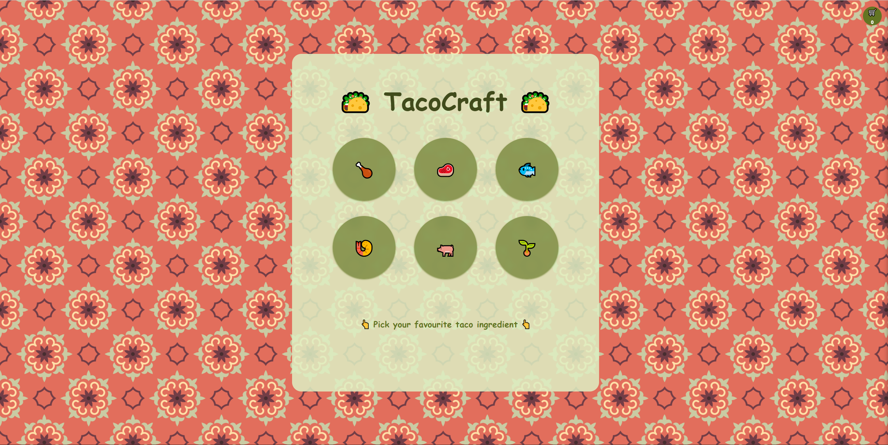
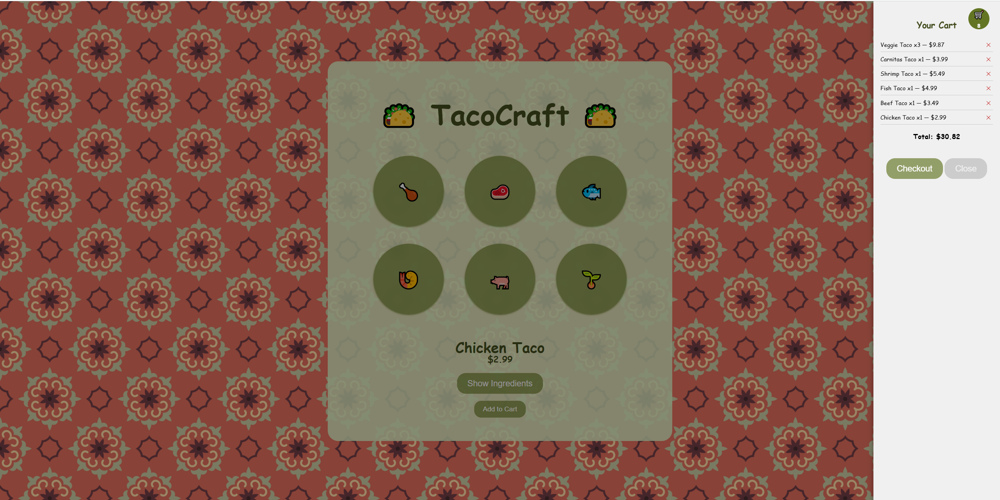
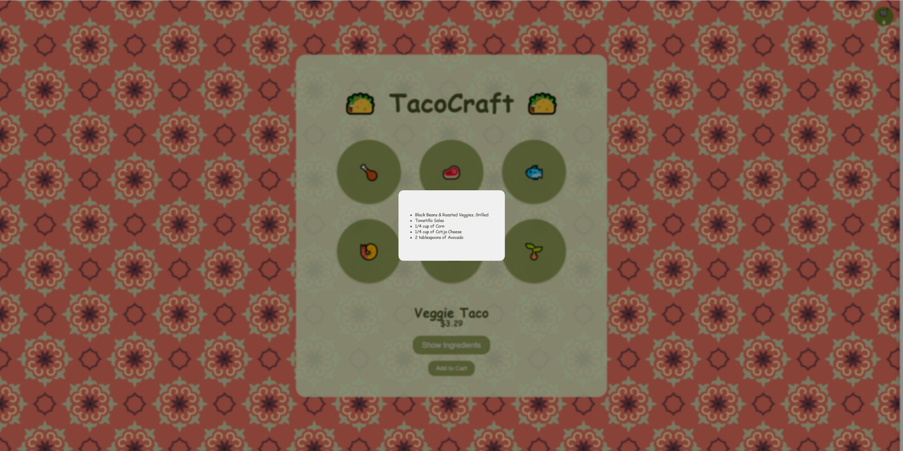
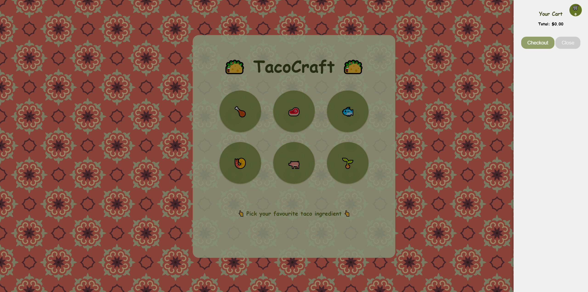
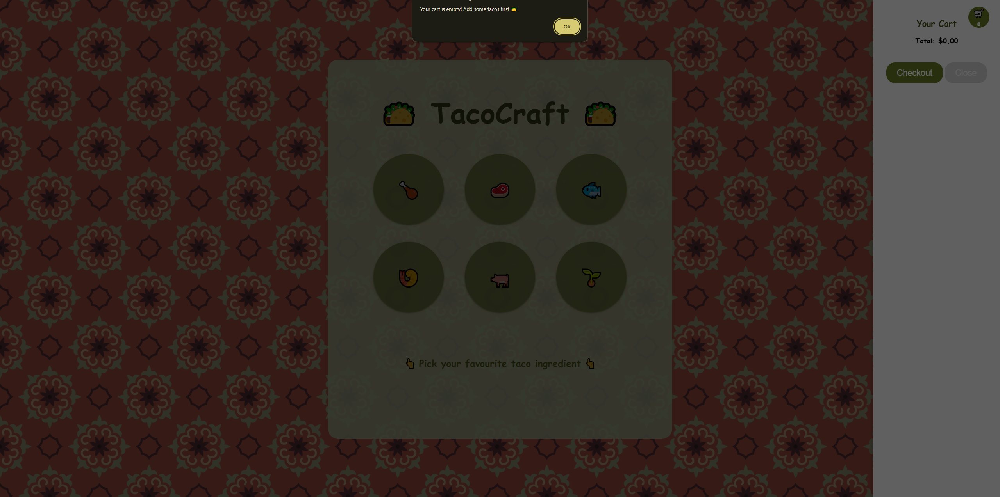
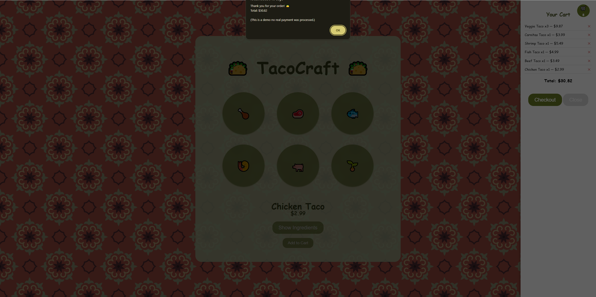
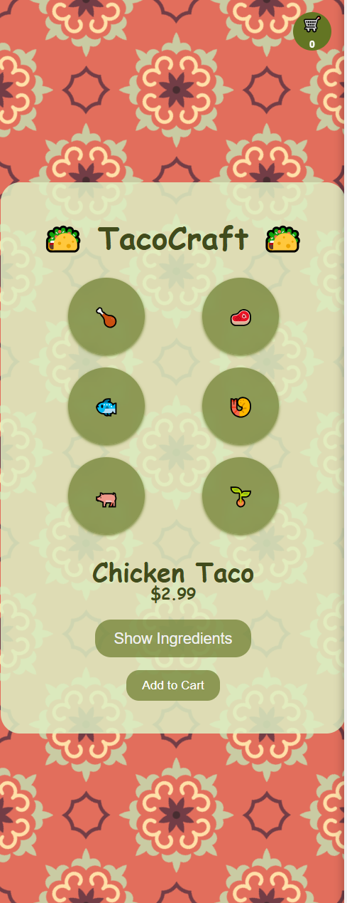

# 🌮 TacoCraft

Welcome to **TacoCraft**, a dynamic web application for building your taco order!
This project demonstrates a full-stack flow using Node.js, Express, and EJS, with a strong focus on interactive UI/UX using Vanilla JavaScript and modern CSS.

---

## 📸 Screenshots

### Desktop View & Cart in Action
- Desktop Version
  
- Cart with Items
  

<details>
  <summary>Click to view more screenshots (Mobile, Modal, Checkout, Empty Cart)</summary>

- Ingredients Modal
  
- Empty Cart
  
- Empty Cart Alert
  
- Checkout Confirmation
  
- Mobile Version
  

</details>

---

## 🚀 Features

- **Dynamic Recipe Fetching** – Uses the Fetch API to retrieve taco details without reloading the page
- **6 Taco Options** – Chicken, beef, fish, shrimp, pork, and veggie, each with its own protein, salsa, and toppings
- **Shopping Cart** – Add items, adjust quantities, remove items, and see the total update live
- **Checkout Flow** – Simulated checkout confirms the order total and clears the cart
- **Glassmorphism UI** – A clean, translucent interface using `backdrop-filter: blur`
- **Responsive Design** – Custom layouts for mobile, tablet, and desktop breakpoints
- **Interactive Ingredients Modal** – Custom overlay to display ingredient details
- **State Management** – UI updates dynamically (cart count, totals, ingredient popups)

---

## 🛠️ Tech Stack

- **Backend**: Node.js, Express.js
- **Templating**: EJS (Embedded JavaScript)
- **Frontend**: Vanilla JavaScript (ES6+), CSS3 (Variables & Animations)
- **Data**: JSON-based recipe storage

---

## 📂 Project Structure

```text
tacocraft/
├── public/
│   ├── styles/
│   │   └── main.css
│   └── script.js
├── views/
│   └── index.ejs
├── index.js
├── recipe.json
└── package.json
```

## ⚙️ Installation & Setup

1. Clone the repository

git clone <your-repository-link>

2. Install dependencies

npm install

3. Run the server

Development

nodemon index.js

Production

node index.js

4. Open in browser

http://localhost:3040

## 🎨 Design Notes

- Primary Color: `#414b1c` (Deep Forest Green)
- Accent Color: `#637523` (Taco Lime)
- Container: Translucent `#ddeec1dc` with blur effects
- Custom SVG background pattern for visual texture

## ✨ Future Improvements

- [ ] Add animations between state changes
- [ ] Store cart contents in localStorage
- [ ] Improve accessibility (ARIA, keyboard nav)
- [ ] Real payment integration for checkout

## 📜 License

This project is open source and free to use.

Created with ❤️ by Tetyana.
